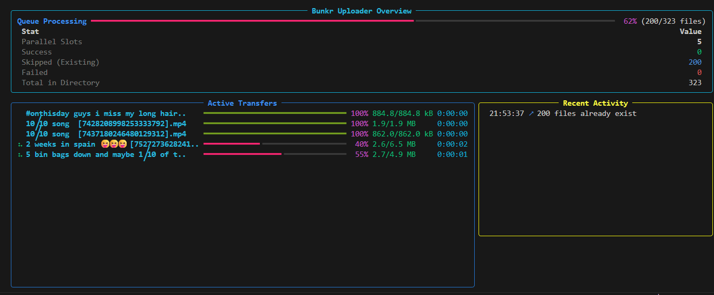

# Bunkr Uploader Tool

A robust multi-threaded Python tool for uploading files to Bunkr.cr with automatic album synchronization and batch processing.

## Features

- **Multi-threaded Uploads**: Uses a thread pool to upload multiple files concurrently.
- **Auto-Synchronization**: Checks the remote Bunkr album state before starting and updates the local log.
  - Adds files already on Bunkr to the local log to skip duplicates.
  - Clears missing files from the local log to trigger re-uploads.
- **Chunked Uploading**: Automatically handles large files by splitting them into chunks.
- **Real-time TUI**: Beautiful terminal interface using `rich` showing progress bars for each thread.
- **Verification Tool**: Includes a separate script to verify the integrity of your uploads.



## Setup

1. Clone this repository.
2. Install the package locally:
   ```bash
   python -m pip install bunkr_uploader
   ```
   This will install all dependencies and register the `bunkr_uploader` command.

3. (Optional) Set your API token as an environment variable:
   ```bash
   $env:BUNKR_TOKEN="your_token_here"  # PowerShell
   set BUNKR_TOKEN=your_token_here      # CMD
   ```

---

## 🚀 Usage (Terminal / PowerShell / CMD)

You can run these commands from any directory if your Python `Scripts` folder is in your PATH.

### Example commands
```bash
# Standard command
bunkr_uploader C:\path\to\your\folder -t TOKEN -a ALBUM_ID

# Alternative if PATH isn't set
python -m bunkr_uploader C:\path\to\your\folder -t TOKEN -a ALBUM_ID
```

---

## Options & Flags

### `bunkr_uploader`
```text
usage: bunkr_uploader [-h] [-t TOKEN] [-f FOLDER] [-a ALBUM] [-c CONNECTIONS] [-r RETRIES] [--no-save] file

positional arguments:
  file                  File or directory to look for files in to upload

options:
  -h, --help            show this help message and exit
  -t, --token TOKEN     API token for your account
  -f, --folder FOLDER   Folder name on Bunkr (overrides local dir name)
  -a, --album ALBUM     Existing Album ID to upload to (Optional)
  -c, --connections CONNECTIONS
                        Max parallel uploads (Default: 5)
  --public              Make the album public when creating or uploading to it
  --no-save             Don't save uploaded file names to a log file
```

## 🗺️ Roadmap & To-Do

### ✅ Achieved Features
- [x] **Automatic Album Creation**: Automatically creates or finds an album if no ID is provided.
- [x] **Album Privacy Control**: Option to set album privacy (--public) during creation or update.
- [x] **Multi-threaded Parallel Uploads**: Up to 5 parallel uploads.
- [x] **Full Album Synchronization**: fix page pagination handling for updating log file (36+ pages / 1700+ files tested).
- [x] **Size-Aware Matching**: Prevents duplicates even when Bunkr mangles filenames with emojis.
- [x] **Automatic Log Management**: Local `.log` updates based on actual remote state.
- [x] **Large File Support**: Seamless chunked uploading for videos.
- [x] **Rich TUI**: Real-time progress monitoring and activity logs.
- [x] **Verification Engine**: Standalone tool to cross-reference logs with Bunkr.


### ⏳ Planned Features / To-Do
- [ ] **Extension Filtering**: Allow specifying allowed types like `.mp4`, `.jpg`, `.png`.
- [ ] **Size Filtering**: Option to restrict uploads by minimum or maximum file size.
- [ ] **Date Filtering**: Only upload "new" files created/modified after a specific date.
- [ ] **Retry Logic Enhancement**: More granular control over per-file retry attempts.


### Synchronization Logic
The tool automatically synchronizes with the Bunkr album before every upload:
1. It fetches the list of files already in the remote album.
2. It updates your local `.log` file so you don't waste time on duplicates.
3. If a file is in your local log but "vanished" from Bunkr, it clears the log entry to trigger an automatic re-upload.

## 🔍 Bunkr API Insights

During the development of this tool, we've gathered the following insights into how the Bunkr Dash API works:

### Pagination
- **Endpoint**: `https://dash.bunkr.cr/api/uploads/{page}` where `{page}` starts at `0`.
- **Page Size**: The API returns a maximum of **50 files per page**. To retrieve a full album list, you must iterate through the pages (`0`, `1`, `2`, etc.) until an empty set is returned.

### Advanced Filtering & Sorting
The Bunkr API accepts a `Filters` header that provides powerful control over the returned files:

| Type | Example | Description |
| :--- | :--- | :--- |
| **Album ID** | `albumid:578462` | Filter by a specific album. |
| **No Album** | `albumid:-` | List only files NOT in an album. |
| **Exclusion** | `-albumid:69` | All uploads EXCEPT those in album 69. |
| **Date (Since)** | `date:2019/06` | Uploads since "1 June 2019". |
| **Date (Before)** | `date:-2020/02/05` | Uploads before "5 February 2020". |
| **Date Range** | `date:"2020/04/07 12-..."` | Uploads between specific times. |
| **Name Match** | `*.gz -*.tar.gz` | Match `.gz` files but skip `.tar.gz`. |
| **Sort (Size)** | `sort:size:d` | Sort by file size descending (`:d` for desc). |
| **Sort (Date)** | `sort:timestamp:d` | Sort by upload date descending. |

---

Original code by [alexmi256](https://github.com/alexmi256/bunkrr-uploader)